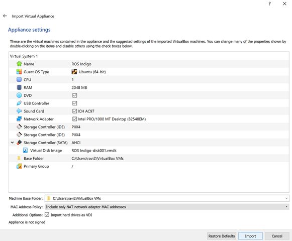

## Steps of Importing an OVA File in VM

    
     
    Step 1
     
    
     
    Step 2
     
    
     
    Step 3
     
    
     
    Step 4
     
    
     
    Step 5
     
    
     
    Step 6
     
    
     
    Step 7
     

